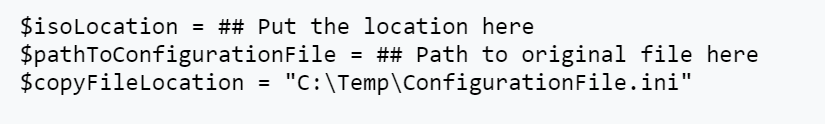
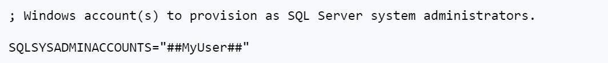
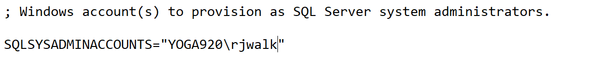

# Automating SQL Server Developer Edition Installation
This repository contains the necessary scripts to automate the installation of SQL Server Developer Edition onto a developer's machine.  This process leverages the [Microsoft Documentation to Install SQL Server from Command Prompt](https://docs.microsoft.com/en-us/sql/database-engine/install-windows/install-sql-server-from-the-command-prompt?view=sql-server-2017)

## Using this Repo
Clone this repo onto your machine and follow these steps.

- Download the ISO for [SQL Server Developer Edition](https://www.microsoft.com/en-us/sql-server/sql-server-downloads).
- Open up InstallSQLDeveloperEdition.ps1 as an Admin
- Change the following section at the top of the file.  The top line is where you downloaded the ISO.  The second line is the full path to ConfigurationFile.ini in this git repo.

- Run the PowerShell Script

The .ini file will be copied over to a C:\Temp directory.  That is because it will change this line:

To your login account automagically

Please note: This file will set the SA password is `REPLACE THIS PASSWORD`